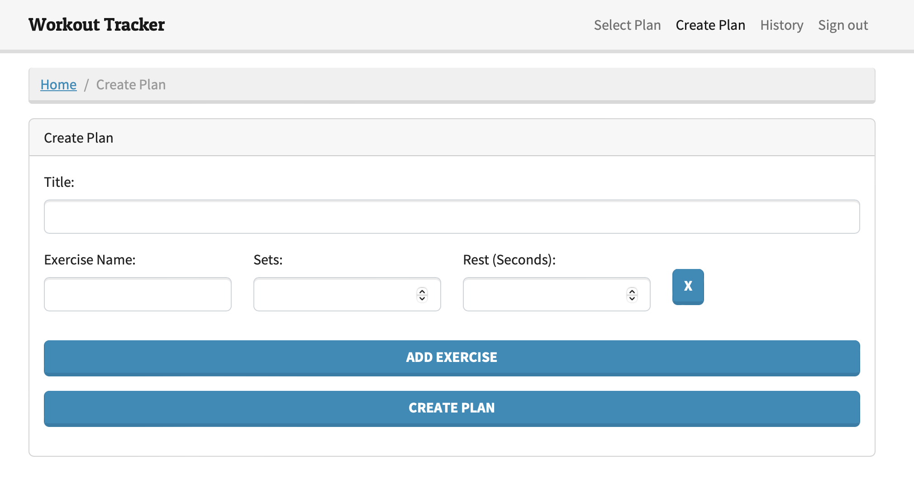

# Workout Tracker Backend

**This project is a work in progress.**



## Overview

The Workout Tracker Backend is an application that provides the backend functionality for a workout tracker app. It allows users to create and track their workout plans, retrieve workout history, and monitor their progress. The backend is built using Python and utilizes the `FastAPI` framework, which is wrapped with `Magnum` for seamless deployment to AWS Lambda. The data is stored in a `DynamoDB` database, and the API is exposed through `API Gateway`.

## Features

- User-friendly API for managing workout plans
- Track and monitor workout progress
- Retrieve workout history
- Seamlessly deployable to AWS Lambda using `Magnum`
- Utilizes `DynamoDB` for efficient data storage and retrieval

## Installation

To run the Workout Tracker Backend locally, follow these steps:

1. Clone the repository:

   ```bash
   git clone https://github.com/your-username/workout-tracker-backend.git
   ```
2. Install the required dependencies using Poetry:

   ```bash
   cd workout-tracker-backend
   poetry install
   ```
3. Set up the database:

   - Install and configure `DynamoDB` locally.
   ```
   docker-compose up -d
   ```
   - Create the database tables:
   ```
   poetry run python create_dynamodb_locally.py
   ```
4. Run the application:

   ```bash
   poetry run uvicorn src.main:app --reload
   ```

## API Documentation

The API documentation provides detailed information about the available endpoints and request/response formats. To access the API documentation, run the application locally and navigate to http://localhost:8000/docs in your web browser.

